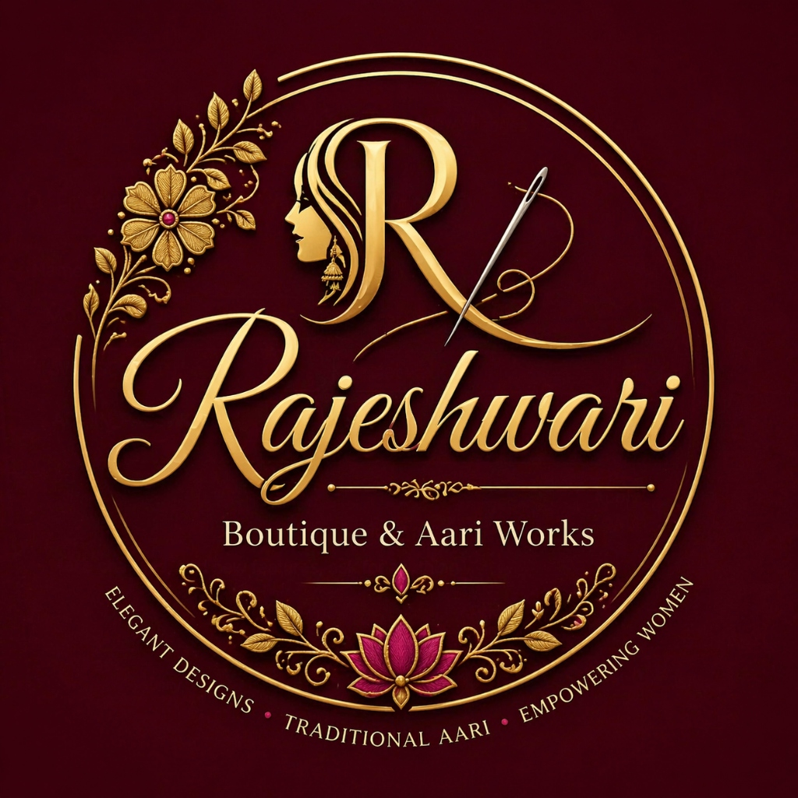

<div align="center">

</div>

# Rajeshwari Boutique

A full-stack web application for Rajeshwari Boutique, featuring an elegant UI to showcase services, an about section, and a contact page. Built with React, Vite, Express, and an in-memory MongoDB database.

## Features
- **Responsive Design**: Modern and elegant UI tailored for a boutique.
- **Services Showcase**: Detailed list of services offered including Aari works and custom tailoring.
- **Contact Form**: Easy way for customers to reach out.
- **In-Memory Database**: Seamless setup with no external database configuration required.

## Tech Stack
- **Frontend**: React, Vite, CSS
- **Backend**: Node.js, Express.js
- **Database**: In-memory MongoDB

## Getting Started

### Prerequisites
- Node.js (v18 or higher recommended)

### Installation
1. Clone the repository:
   ```bash
   git clone <repository-url>
   ```
2. Install dependencies:
   ```bash
   npm install
   ```

### Running Locally
Start both the frontend development server and the backend server:
```bash
npm run dev
```

The app will be available at `http://localhost:5173`.

## Deployment
This project is configured for easy deployment on [Render](https://render.com/) using the included `render.yaml` configuration.
